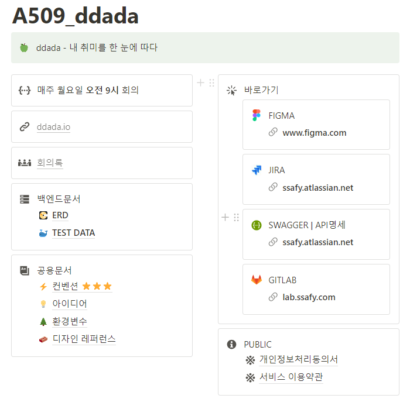
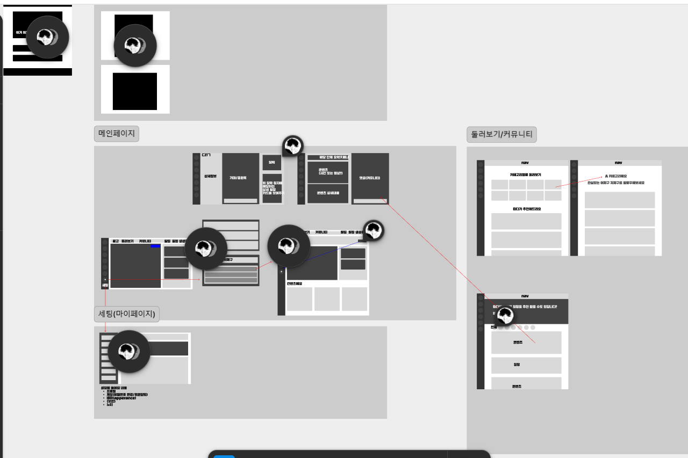
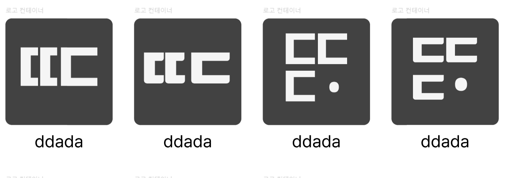

## 한 일

### 기획
- [x] 아이디어 기획 회의
- [x] 아이디어 회의
- [x] JIRA 프로젝트 생성
- [x] 프로젝트 관리 notion 제작

### 디자인
- [x] 로고디자인
- [ ] 디자인가이드 제작
- [x] 디자인 레퍼런스 검색
- [ ] 랜딩페이지 디자인
- [ ] 로그인/회원가입 페이지 디자인
- [x] 와이어프레임 구상 및 제작

###  작업내용

### 노션

### 피그마 와이어프레임

### 로고 디자인

