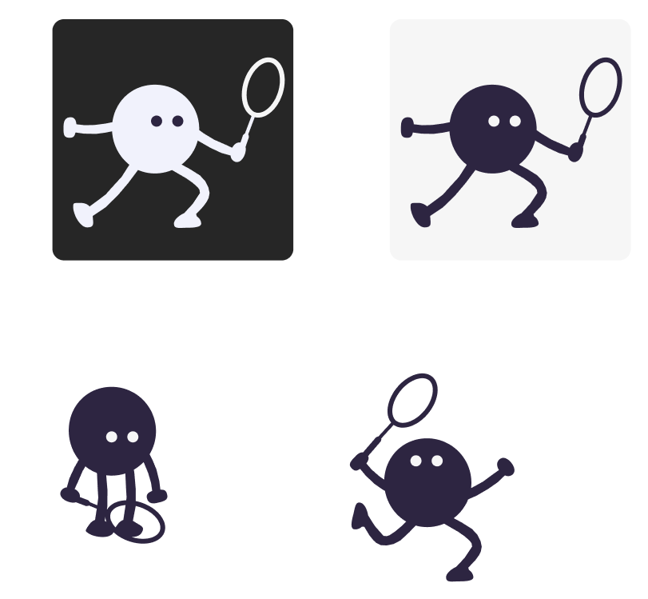
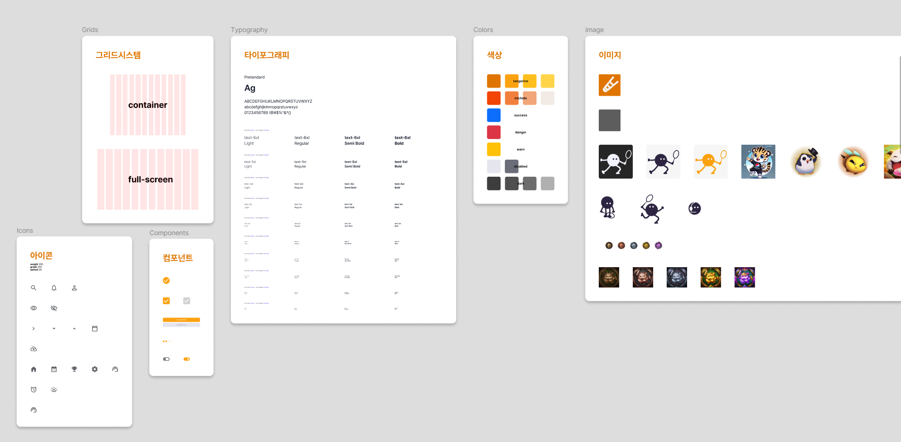

## 한 일

> 아이디어가 새로 변경됨에 따라 기획을 다시 진행하고, 디자인 또한 새로 진행하였습니다.

### 기획
- [x] 아이디어 기획
- [x] 아이디어 기능 명세(IA) 및 페이지 정리
- [x] 데이터 적재 기반 마련
- [x] 팀원에게 도메인 설명

### 디자인
- [x] 로고디자인
- [x] 디자인가이드 제작
- [x] 디자인 레퍼런스 검색
- [x] 로그인/회원가입 페이지 디자인
- [ ] 매니저 페이지 제작
- [x] 배드민턴 모의 플레이 점수판 디자인 제작

## 학습한 내용
- Figma의 `auto-layout`의 활용에 대해 이해할 수 있었음
    - 프론트엔드, 백엔드를 모두 다뤄보고 디자인을 직접 하니 개발을 고려해서 디자인을 할 수 있게 되었음
- undo, redo의 로직에서 사용자 경험을 고려하여 undo를 진행한 뒤 데이터를 바꾸면 이전까지 기록돼있던 이후 데이터는 모두 날리는 것이 적절함을 알게되었음
- 빅데이터가 존재하지 않는 주제(도메인)에 대해서는 적재방식부터 논의하고 유의미한 데이터인지 검증하는 과정까지 이루어져야 한다는 사실을 알게되었음.
    - 사용자에 의해 쌓이는 데이터는 cold start문제를 직면하게 되는데 이러한 경우 이미 존재하는 단체에서 인터뷰, 설문 등의 기법을 사용하는 것이 적절함 
    - 빅데이터를 임시로 해결하기 위해 더미데이터를 구성하는 것은 좋지 않으므로, 유의미한 데이터를 어떻게 뽑아올 수 있을지 고민해야 함

##  작업내용

### 캐릭터 디자인

### 디자인 가이드

### 로그인 페이지
.png)

### 회원가입 페이지
.png)
.png)

### 매니징 페이지
